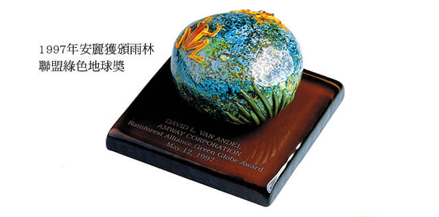

# 為環境付出關愛

  回顧 1959 年，「可被生物分解」（ biodegradable ）還是一個不甚起眼的名詞，或許你曾在雜誌上無意間翻閱到，或者在聚會時無意中聽到，你大概會以為這個名詞與生物學或地球有關，不管它是什麼，總之不是壞事。

  雖然我們並不是環境專家，但是我們相信：安麗若要成功，就必須提供一些超越競爭廠商的理念與服務；我們所需要的產品，除了好之外，還應該包含其他的意義。因此，安麗所推出的第一項產品 ── L.O.C.，不僅含有可被生物分解的清潔成分，同時也不含磷酸鹽、溶劑或腐蝕性物質，對環境很溫和，其濃縮及可被生物分解的配方，加上卓越的洗淨力，使這項產品大受歡迎。

  當然，L.O.C. 只是個起點而已。實際上，安麗自創業以來，即許下環保的承諾，同時，我們多年來的努力也受到國際的肯定。1989 年，聯合國環境保護組即頒贈了一項「環保成就獎」給安麗公司，以表彰安麗對環保的貢獻。1992 年，我們又接受美國野生動物保護聯盟的頒獎表揚。然而，[**關心環境問題就如同建立一份事業一樣，不能因為得獎就停下腳步來。如果你對自己的工作很認真，而且朝著已確定的目標前進，那麼你不應該對既得的榮譽感到滿足。你要繼續依循自己的理想，設定新的目標，並努力去達成。這也就是為什麼安麗不斷地投入環保活動，並積極喚起大眾環保意識的原因。**](jing-fu-chu.md)

  為此，我們很高興能在義大利熱那亞舉辦的世界博覽會中，擔任美國展示館的主要贊助者。安麗環境基金會特別為此次的展示館設計了一項展覽，藉以對國際訪客展示安麗在全球各地的成長與發展，及其對環保的使命，並促成了國際性的環保合作計畫。

  由安麗環境基金會所贊助的「北極原住民藝術展」，也已在巴西里約熱內盧所召開的「聯合國環境與發展會議」中陳列展出。我們對於能繼續贊助這次展覽，並前往參加開幕儀式一事，深感驕傲。

  上述這些活動都很重要，因為他們都突顯出我們在環保上的任務。然而，環保也是我們每日力行的工作 ── 從生產並銷售可被生物分解的產品、發起植樹活動，到回收利用資源 ── 這一切對我們的生活環境都將產生莫大影響。

  在今天這麼注重環保的時代，關心我們的事業亦包括關心我們的生活環境。

